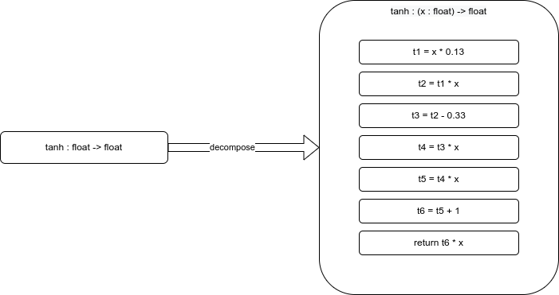

# StableHLO Extensibility
## Background
StableHLO is intended to be used both as a front-end interface, and as a hardware interface. A major issue in hardware-software design currently is providing stable implementations across different hardware while using varying levels of software/IR abstractions.

This is especially prevalent in [transcendental functions](https://en.wikipedia.org/wiki/Transcendental_function), which cannot be represented precisely and rely on approximations that can vary by platform. A simple example of this is `stablehlo.tanh` - there are many other possible approximation methods of `tanh` which have performance and precision differences on different hardware backends. _One possible_ implementation of `tanh` on f32 input could leverage [Horner’s method](https://en.wikipedia.org/wiki/Horner%27s_method), where `tanh` decomposes to a series of multiplication and additions:



Currently there is not a great way in StableHLO to denote a portable reference implementation for `tanh`. If one did exist, different hardware backends could opt to use the stable reference for numerical consistency across platforms, or ignore it in favor of hardware-specific performance improvements. This document proposes a mechanism to specify composite operations and their reference implementations.

## Requirements
The following requirements are based on discussions with engineers facing hardware abstraction and IR portability issues similar to `tanh` case above:

| R# | Description |
| -- | ----------- |
| R1 | Must provide a means of conveying a high level abstraction alongside a reference implementation. |
| R2 | Abstractions must be stable. |
| R3 | Must permit arbitrary levels of composite nesting. |
| R4 | Must provide a mechanism for creating arbitrary compositions. _(Must more than just a means to provide reference implementations for existing StableHLO ops.)_ |

Please let me know if there are any missing requirements for individual use cases.

## Proposed Design

_Note, this is a very early design proposal. I'm most interested to hear what works or doesn't work about this design to help formulate a best final design._

### Add op for `stablehlo.composite`

One possible design is to introduce a new op to StableHLO which will be used to denote the union of an operation, and a reference implementation. The current working name for that op is `stablehlo.composite`.

This op will have two regions, each with a single op and return:
1. The abstracted operation name.
2. A call to a function containing the reference implementation.

The following example shows how `stablehlo.tanh` with a reference implementation could look:

```
%0 = stablehlo.composite %arg0 is { 
  %1 = stablehlo.tanh(%arg0) : (tensor<1xf32>) -> tensor<1xf32>
  stablehlo.return %1 : tensor<1xf32>
} with reference {
  %2 = func.call @tanh_f32_horners(%arg0) : (tensor<1xf32>) -> tensor<1xf32>
  stablehlo.return %2 : tensor<1xf32>
} : (tensor<1xf32>) -> tensor<1xf32>
```

Or, more concisely printed:

```
%0 = stablehlo.composite stablehlo.tanh(%arg0) with reference @tanh_f32_horners : (tensor<1xf32>) -> tensor<1xf32>
```

One slight modification (if beneficial) would be to remove the function call region, and instead store a reference to the function in an attribute:

```
%0 = stablehlo.composite %arg0 is ({ 
  %1 = stablehlo.tanh(%arg0) : (tensor<1xf32>) -> tensor<1xf32>
  stablehlo.return %1 : tensor<1xf32>
}) {reference = @tanh_f32_horners} : (tensor<1xf32>) -> tensor<1xf32>
```

The use of a function call for the reference implementation is used to avoid unnecessary memory overheads. If we wanted all instances of `tanh` in the file to use the same reference implementation, we wouldn't want to copy the function each time. Type correctness is enforced at the function call boundary.

Different backends can then either "accept" the reference implementation (inline the second region), or "reject" it and inline the first region.

To create an arbitrary composite section, the first region can use a `CustomCallOp`. The following is an example of a custom composite op given the name `my_gpu.add2` op, which performans an elementwise add of the constant `2` to the input argument:

```
%0 = stablehlo.composite %arg0 is { 
  %1 = stablehlo.custom_call "my_gpu.add2"(%arg0) : (tensor<1xf32>) -> tensor<1xf32>
  stablehlo.return %1 : tensor<1xf32>
} with reference @add_two : (tensor<1xf32>) -> tensor<1xf32>
```

This provides a _(fragile)_ mechanism for backends to special-case certain functions when `my_gpu.add2` is known, but more likely, the custom function will be unknown and the reference implementation accepted and inlined.

### Restrictions on reference implementations

- Reference implementations may contain composite blocks (R3).
- Reference implementations must consist of only StableHLO operations or function calls in nested composite blocks (R2).
- Reference implementation function must be inline-able.

## Alternative

One possible alternative:

Add optional attributes for `{reference = @fn}` for operations that support reference implementations. This is less flexible and require controlling which ops can have reference implementations.

Under this scheme, arbitrary blocks would either be expressed using `custom_call` or we could introcude `stablehlo.composite "composite_name"(args){ body }` to address composites.


## Open Questions

**Does introducing a new op get in the way of existing optimizations?**

- If this op is introduced, would this inherently prevenrt any optimizations that exist for `tanh`, or introduce a large overhead to performing those optimizations?
- Does this matter? If we are providing a reference implementation we likely care about numerical precision, and we should avoid optimizing this call site, unless inlined first.

**Is it enough for this solution to be confined to StableHLO?**

- If the solution for the issue of "provide a reference implementation for an op" lives only in StableHLO, does that satisfy all use cases?
- Can all necessary upstream components target StableHLO, and can compiler backends consume StableHLO directly?
- Would this mechanism need to be MLIR native, so that we can convert from `stablehlo.tanh` to a lower level implementation in another dialect, while still preserving the reference implementation in the other dialect?